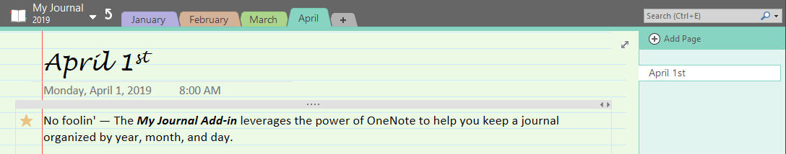
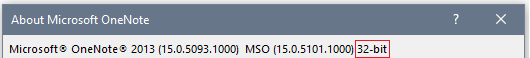
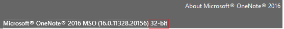

# *MyJournal.Notebook*
***MyJournal.Notebook*** makes journaling with OneNote as simple as possible, but not simpler! 
 
Follow me on Twitter for updates and general questions. 
 

## About
>Record your daily interactions, ideas and inspirations with this add-in for Microsoft® OneNote® 2010 / 2013 / 2016 Windows desktop versions (32-bit).

<table hspace="25">
	<tr>
		<th scope="row">
			
		</th>
		<td>With one click of a button, this add-in
		 creates a notebook on local storage
		 organized by year, month, and day.</td>
	</tr>
	<tr />
	<tr>
		<th scope="row">User
		 Configurable
		 Settings</th>
		<td>
			<ul>
				<li>Page color</li>
				<li>Page title date format</li>
				<li>Page rule lines</li>
				<li>Page template</li>
			</ul>
		</td>
	</tr>
	<tr />
	<tr>
		<th scope="row">Language</th>
		<td>C #</td>
	</tr>
	<tr />
	<tr>
		<th scope="row">License</th>
		<td>
			<a href="LICENSE.txt">Microsoft Public License (MS-PL)</a>
		</td>
	</tr>
	<tr />
	<tr>
		<th scope="row">Disclaimer</th>
		<td><b><i>MyJournal.Notebook</i></b> software is not developed by or affiliated with the Microsoft Corporation.</td>
	</tr>
	<tr />
	<tr>
		<th scope="row">Trademarks</th>
		<td>Microsoft and OneNote are registered trademarks of Microsoft Corporation.</td>
	</tr>
</table>

## Requirements
 * .NET Framework 4.6.2 or later 
 * OneNote 2010 / 2013 / 2016 Windows desktop software (32-bit) 
 * Visual Studio 2017 version 15.2 or later (developers only) 

## Installation
- To install this add-in, you must have a 32-bit Windows desktop version of OneNote 2010 / 2013 / 2016.

	- OneNote for Windows 10 is not supported.

	- To find the bitness for your version of OneNote:
		1. Press the `Windows + Shift + N` keys to open OneNote.

		2. For OneNote 2013 (Version 15.0) / 2016 (Version 16.0):
			- Click on File &#x2192; Account &#x2192; About OneNote button  

		3. For OneNote 2010 (Version 14.0):
			- Click on File &#x2192; Help 

	- After confirming you have a 32-bit version of OneNote, download and install the MSI file from the [releases](releases) page.

## Usage
- [Select journal page template](docs/HowTo-Select-Journal-Page-Template.md)
- [Create journal page](docs/HowTo-Create-Journal-Page.md)
- [Select journal page color](docs/HowTo-Select-Page-Color.md)
- [Select journal page title date format](docs/HowTo-Select-Page-Title.md)
- [Select journal page rule lines format](docs/HowTo-Select-Rule-Lines.md)

## Contributing
I am not accepting contributions to this project at this time. Microsoft has stopped adding new features to the desktop version of OneNote in favor of the cloud-based OneNote for Windows 10. Please read [Frequently Asked Questions about OneNote and Office 2019](https://support.office.com/en-us/article/frequently-asked-questions-about-onenote-and-office-2019-6582c7ae-2ec6-408d-8b7a-3ed71a3c2103 "https://support.office.com/en-us/article/frequently-asked-questions-about-onenote-and-office-2019-6582c7ae-2ec6-408d-8b7a-3ed71a3c2103") for more information.

## Developer Resources
- Check out my Wakelet collection: [OneNote Component Object Model (COM) Programming](https://wakelet.com/wake/0a714a50-a923-4ee5-82f0-2c7171589551)
- [Debugging with DebugView](docs/debugging/DebugView-README.md)
