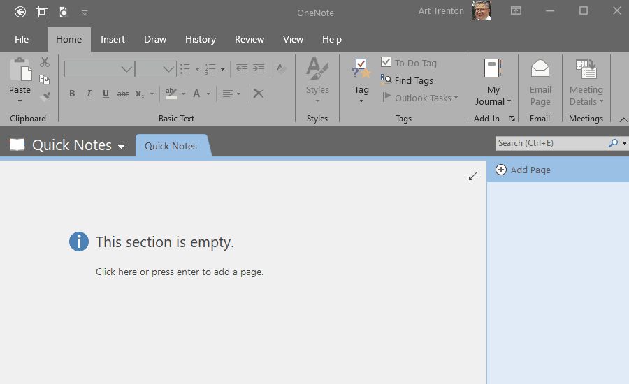

# *MyJournal.Notebook*

---

## Usage

### :star: How-to: Select Journal Paper Size



**NOTE:** Setting the paper size to any value other than ```Automatic``` will result in a fixed height page size. Content exceeding this height overflows the background page color.  See [Known Issues](https://github.com/atrenton/MyJournal.Notebook/blob/master/docs/known-issues.md) for more information.

<p align="right">
  <a href="https://github.com/atrenton/MyJournal.Notebook/blob/master/README.md#usage">:arrow_left: README &ndash; Usage</a><br>
  <a href="https://github.com/atrenton/MyJournal.Notebook/wiki/Configuration#movie_camera-quick-start-videos">:arrow_left: Wiki Configuration &ndash; Quick Start Videos</a>
</p>

Screen capture recorded with [ScreenToGif](https://www.screentogif.com/)