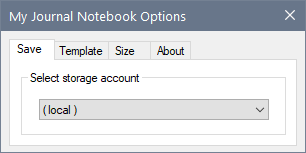

# *MyJournal.Notebook*

---

## Usage

### :star: How-to: Select OneDrive Storage Account



- The default add-in configuration saves your ***My Journal*** notebook on `local` storage.

- To save your notebook on your `OneDrive - Personal` cloud storage, you can select your Microsoft account in the **My Journal Notebook Options** dialog ```Save``` tab.

- To configure OneDrive access in OneNote 2016 and 2013:
    Go to **File** &#187; **Account** &#187; **Connected Services** &#187; select **Add a Service** then **Storage** and choose OneDrive. See [How to add OneDrive as a service](https://support.microsoft.com/en-us/office/how-to-add-onedrive-as-a-service-3ae78a39-c0de-4c86-8abc-ad519b6de44e) if you need more help.

- To move an existing local notebook to OneDrive, see [Move a OneNote notebook to OneDrive](https://support.microsoft.com/en-us/office/move-a-onenote-notebook-to-onedrive-0af0a141-0bdf-49ab-9e50-45dbcca44082 "OneNote 2016, OneNote 2013, Office for business").

**PLEASE NOTE:** Microsoft® OneNote® &ndash; not this add-in &ndash; handles all the syncing of your notes between your computer and OneDrive. Your internet speed is a factor. For more information, see [Best practices for syncing notes in OneNote](https://support.microsoft.com/en-us/office/best-practices-for-syncing-notes-in-onenote-9c6e8fcc-3307-419c-ba77-58cadfe651d7).

<p align="right">
  <a href="https://github.com/atrenton/MyJournal.Notebook/blob/master/README.md#usage">:arrow_left: README &ndash; Usage</a><br>
  <a href="https://github.com/atrenton/MyJournal.Notebook/wiki/Configuration#movie_camera-quick-start-videos">:arrow_left: Wiki Configuration &ndash; Quick Start Videos</a>
</p>
