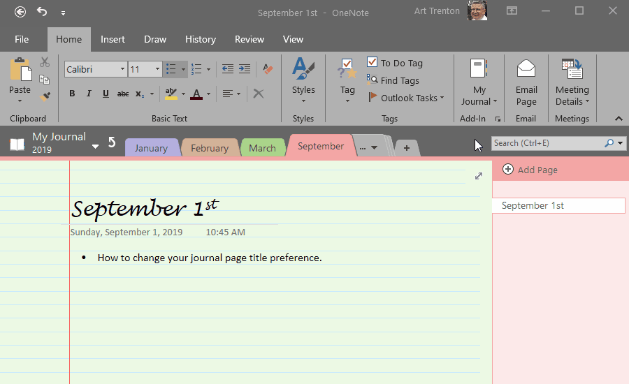

# *MyJournal.Notebook*

---

## Usage

### :star: How-to: Select a Journal Page Title Date Format

  <a href="https://github.com/atrenton/MyJournal.Notebook/blob/master/README.md#usage">:arrow_left: README &ndash; Usage</a> 
  <a href="https://github.com/atrenton/MyJournal.Notebook/wiki/Configuration#movie_camera-quick-start-videos">:arrow_left: Wiki Configuration &ndash; Quick Start Videos</a>

Screen capture recorded with [ScreenToGif](https://www.screentogif.com/)