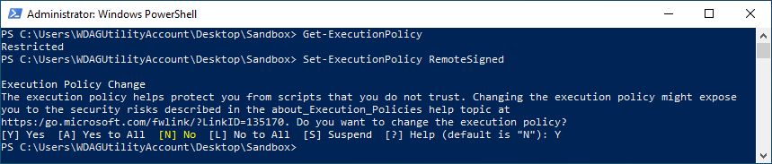

# MyJournal.Notebook Troubleshooting

This is the [MyJournal.Notebook](https://github.com/atrenton/MyJournal.Notebook) troubleshooting guide.

## Scripts

The scripts in this directory can be used to provide information about your Microsoft® OneNote® program and features.

Windows Command Scripts (`.cmd`) are provided as a convenience to wrap the PowerShell Script (`.ps1`) with the same name in order to bypass the default `Restricted` execution policy.

- **[Get-OneNote-Info.cmd] ([Get-OneNote-Info.ps1])** &mdash; Displays information about the location of the ONENOTE.EXE file and image type (32-bit or 64-bit).

- **[List-OneNote-Notebooks.cmd] ([List-OneNote-Notebooks.ps1])** &mdash; Uses the OneNote Component Object Model (COM) API to display a list of notebooks.

[Get-OneNote-Info.cmd]:https://github.com/atrenton/MyJournal.Notebook/blob/master/docs/troubleshooting/Get-OneNote-Info.cmd
[Get-OneNote-Info.ps1]:https://github.com/atrenton/MyJournal.Notebook/blob/master/docs/troubleshooting/Get-OneNote-Info.ps1
[List-OneNote-Notebooks.cmd]:https://github.com/atrenton/MyJournal.Notebook/blob/master/docs/troubleshooting/List-OneNote-Notebooks.cmd
[List-OneNote-Notebooks.ps1]:https://github.com/atrenton/MyJournal.Notebook/blob/master/docs/troubleshooting/List-OneNote-Notebooks.ps1

## Changing PowerShell Script Permissions

If you need to change the execution policy for unsigned PowerShell scripts, perform the following steps.

- Open a PowerShell console as **Administrator**.
- Type the following and press <kbd>Enter</kbd>

    ``` PowerShell
    Get-ExecutionPolicy
    ```

- You may find that its set to **Restricted**. If so, type the following and press <kbd>Enter</kbd>

    ``` PowerShell
    Set-ExecutionPolicy RemoteSigned
    ```

- Hit <kbd>Y</kbd> and press <kbd>Enter</kbd> to accept the change.

**EXAMPLE**

